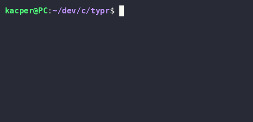

# typr


A lightweight, terminal-based typing speed and accuracy tester written in C.



## Features

- **WPM Calculation:** Measures elapsed time in milliseconds using POSIX high-resolution timers (`CLOCK_MONOTONIC_RAW`), so results aren't affected by system clock adjustments.
- **Accuracy Score:** Computes percentage accuracy from the [Levenshtein distance](https://en.wikipedia.org/wiki/Levenshtein_distance) between what you typed and the reference prompt. Missing, extra, and wrong characters all count as mistakes.
- **Word Counting:** Robust space-delimited word counter that handles repeated, leading, and trailing spaces.
- **No external dependencies:** Only the C standard library, POSIX APIs, and `libm`.

## Build & Run

Requires a POSIX-compliant system (Linux/macOS), `make`, and a C compiler (`gcc` by default, `clang` works too).

```bash
# Clone the repository
git clone https://github.com/kacpersalega/typr.git
cd typr

# Compile (objects go into ./build, the binary is linked as ./typr)
make            # or: make all / make typr

# Run
./typr
```

To build with a different compiler:

```bash
make CC=clang
```

To remove the `build/` directory and the compiled `typr` binary:

```bash
make clean
```

## Usage

1. Run `./typr`. The prompt sentence is printed to the terminal.
2. Type the sentence and press **Enter**.
3. Your typing speed and accuracy are printed.

The timer starts the moment the prompt appears and stops when you press Enter, so start typing right away.

## How It Works

### WPM

Words are counted as runs of non-space characters in your input, and the elapsed time comes from `CLOCK_MONOTONIC_RAW`:

```
wpm = words_typed / elapsed_minutes
```

WPM counts every word you typed, correct or not. Mistakes are reflected in the accuracy score instead.

### Accuracy

The Levenshtein distance is the minimum number of single-character edits (insertions, deletions, or substitutions) needed to turn one string into another. `typr` computes it with a dynamic-programming table, comparing your whole input line against the prompt, then converts it to a percentage relative to the prompt length:

```
accuracy = (prompt_length - distance) / prompt_length * 100
```

The comparison is case-sensitive, and spaces and punctuation count as characters. For example, typing `ovr` instead of `over` is one edit away from the 43-character prompt, which gives (43 - 1) / 43 ≈ 97.7% accuracy.

## Project Structure

```
typr/
├── inc/
│   ├── helper.h
│   └── levenshtein.h
├── assets/
├── src/
│   ├── helper.c        # timing, word counting, accuracy calculation
│   ├── levenshtein.c   # edit distance
│   └── main.c          # prompt, input, results
└── Makefile
```

The build compiles every `src/*.c` file with `-Wall -Wextra` and links against `libm`.